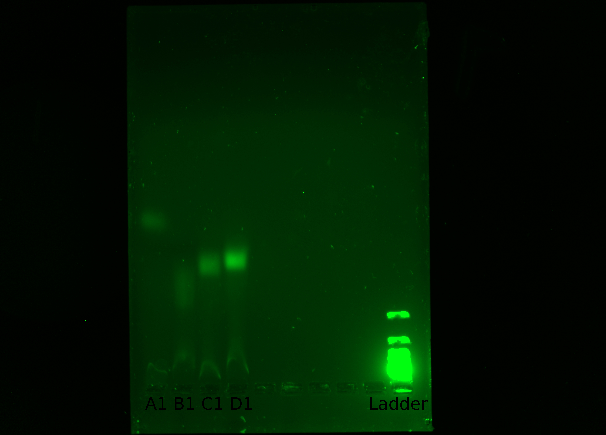

# Homopolymer Expiriment (aka **HoPo**)

**TL;DR**
We used TdT (Terminal Deoxynucleotidyl Transferase) to add dNTPs to the 3' end of oligonucleotides.

*Figure 1*: From right to left: Well 1: 1nmol Untailed Primer of **LENGTH**. Well 2: Tailed .0125nmol Primer. Well 3: Tailed .0625nmol Primer. Well 4: Tailed .125nmol Primer. Well 10 (end): 1kb ladder for reference.

## Summary

HoPo is the first step in a series of experiments that will facilitate the synthesis of DNA without a template in space. We are using TdT or Terminal Deoxynucleotidyl Transferase to add nucleotides to an existing oligonucleotide as a proof of concept to demonstrate that we can add nucleotides to a strand of DNA. We are doing this because we believe that this is the simplest step that we can pursue in relation to TdT catalyzing reactions with DNA. Below are the protocols for the initial attempts at HoPo and the results with reflections upon the results from those protocols.

### HoPo 3

**[Protocol](./HoPo3/HoPo-Protocol.md)** -
**[Results](./HoPo3/Results.md)**

### HoPo 2

**[Protocol](./HoPo2/HoPo-Protocol.md)** -
**[Results](./HoPo2/Results.md)**

### HoPo 1

**[Protocol](./HoPo1/HoPo-Protocol.md)** -
**[Results](./HoPo1/Results.md)**
